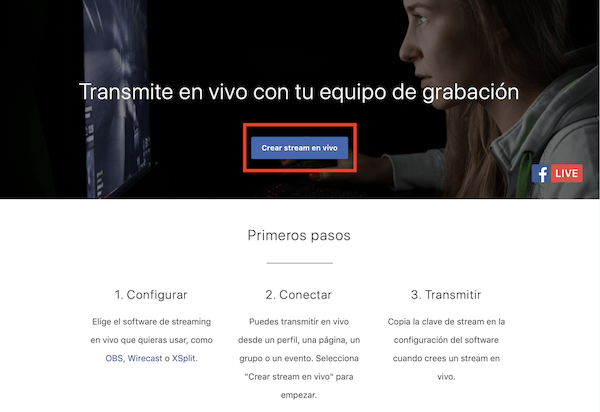
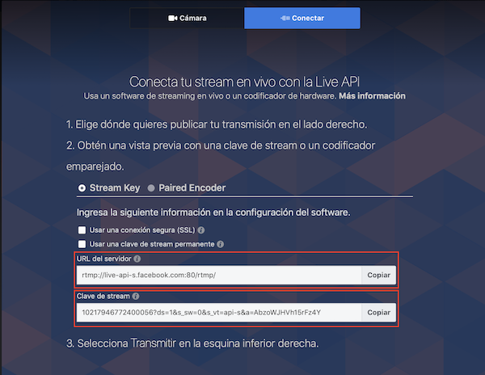

# VideoToFacebookLive
Un modulo simple para transmitir un video hacia `facebook live` usando nodejs.


## Instalacioón

Podemos instalar el modulo desde npm usando:

```javascript
npm i video-to-facebook-live
```

### Requerimientos:

- ffmpeg instalado
- nodejs

## ¿Como funciona?

Se abstrae una llamada a `ffmpeg` con los parametros minimos necesarios para poder realizar una transmision exitosa hacia un video en vivo de facebook.


## ¿Como usarlo?

En esta primera version es necesario crear manualmente una transmision hacia donde transmitir el video local.

### Crear un video en facebook live de forma manual

Dirigirse a la herramienta de creacion de videos en vivo https://www.facebook.com/live/create



En la pagina resultante podremos obtener una url de servidor y un identificador de nuestro nuevo video en vivo.



### Modo de uso

```javascript
// Importar el modulo
var videoToFacebookLive = require('video-to-facebook-live');

// Parametros para la transmision
var rtmp_uri = "rtmp://live-api-s.facebook.com:80/rtmp/";
var stream_key = "10217959536199143?d....";
var video_file = ".videos/big_buck_bunny.mp4";

// Iniciar el proceso de transmision
process = videoToFacebookLive.fromFile(video_file, rtmp_uri + stream_key)

// Se puede consultar por el proceso encargado del encoding y transmision
console.log("Video is being processing with pid: " + process.pid)

```

## Caracteristicas de los videos aceptados por facebook para un video en vivo

### Formato de video:

- Se aceptan videos con una resolución máxima de 720 píxeles (1.280 × 720) a 30 fotogramas por segundo, con un fotograma clave cada dos segundos.
- Se debe enviar al menos un frame (fotograma clave) cada dos segundos durante la transmisión.
- La tasa de bits máxima recomendada es de 4 Mbps. Aunque es posible traspasar este límite, eso haría que las transmisiones en vivo fueran muy inestables.
- Si se cambia la resolución en mitad de la transmisión, esta última se puede perjudicar.
- Los títulos deben tener menos de 255 caracteres. De lo contrario, se producirá un error en la transmisión.
- La Live API solo admite video codificado H264 y audio codificado AAC.

### Duración del video:

- Duración máxima de cuatro horas para las transmisiones en vivo.
- Duración máxima de cuatro horas para las transmisiones de vista previa (tanto en el cuadro de diálogo de transmisión en vivo como en las herramientas de editor). Después de 240 minutos, se deberá generar una nueva clave de transmisión.
- Las URL de transmisión RTMP caducarán 24 horas después de su creación.

### Configuración de audio avanzada:

- Frecuencia de muestreo de audio: 48 kHz
- Velocidad de bits de audio: 128 Kbps mono
- Códec de audio: AAC

### Configuración de video avanzada:

- Relación de aspecto del píxel: cuadrado
- Tipos de fotogramas: escaneo progresivo
- Velocidad de bits de codificación: CBR
- Códec de video: H264

## Proximos pasos

- Permitir encolar videos a transmision
- Permitir transmitir desde un elemento HTML canvas
- Permitir configurar los parametros de la transmision